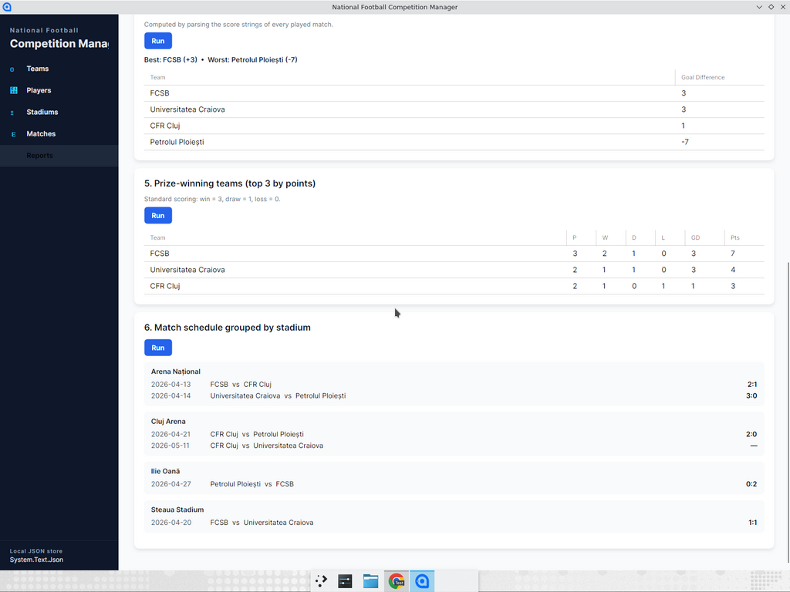
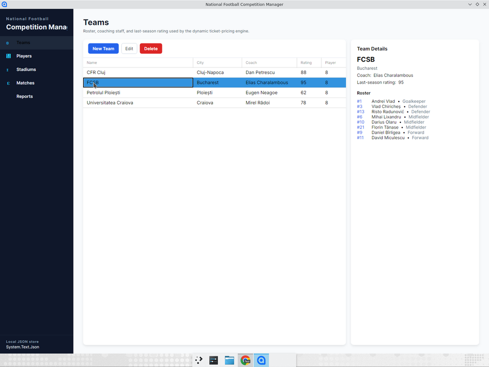
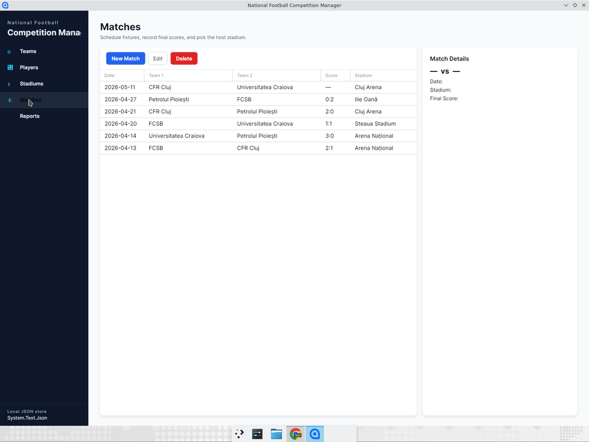
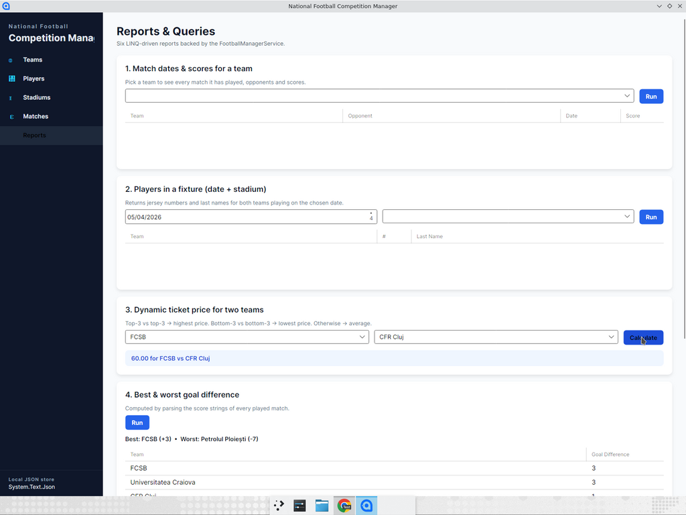

# National Football Competition Manager

A modern, MVVM-based desktop application for managing a national football
competition. Teams, players, stadiums and matches are stored locally in JSON
files via a generic repository, and a dedicated reporting screen runs the six
LINQ queries described in the original spec.



## Tech stack

| Layer            | Choice                                       |
| ---------------- | -------------------------------------------- |
| Runtime          | .NET 10 (C# 14)                              |
| UI framework     | Avalonia 12                                  |
| MVVM helpers     | CommunityToolkit.Mvvm 8 (source generators)  |
| Persistence      | `System.Text.Json` + custom `FileRepository<T>` |
| Data grid        | `Avalonia.Controls.DataGrid`                 |

## Project layout

```
src/FootballCompetition/
├── Models/                 // Team, Player, Stadium, Match
├── Data/                   // FileRepository<T> + DataAccessException
├── Services/               // FootballManagerService (LINQ queries) + DataSeeder
├── ViewModels/             // One VM per section + MainWindowViewModel
├── Views/                  // MainWindow + per-section UserControls
└── App.axaml(.cs)          // Composition root, wires repositories & seed data
```

## Building & running

You need the .NET 10 SDK (`dotnet --version` should report `10.0.x`).

```bash
# Restore + build
dotnet build

# Run the desktop app
dotnet run --project src/FootballCompetition
```

The first launch seeds the JSON store with four teams, eight players each, four
stadiums and a six-match round so the reporting screen has data to work with.
Data is written to:

* Linux  : `~/.local/share/FootballCompetition/data/`
* macOS  : `~/Library/Application Support/FootballCompetition/data/`
* Windows: `%LOCALAPPDATA%\FootballCompetition\data\`

Override the location for testing with the `FOOTBALL_COMPETITION_DATA_DIR`
environment variable.

## Architecture notes

### `FileRepository<T>`

A small generic JSON-backed repository. Mutations are written atomically (temp
file + `File.Replace`) and every I/O failure is wrapped in a
`DataAccessException` so the UI's global error overlay can surface a single,
uniform message to the user.

### `FootballManagerService`

Owns the four repositories and exposes both CRUD pass-throughs and the six
analytical queries:

| # | Query                                                                               |
| - | ----------------------------------------------------------------------------------- |
| 1 | Match dates, opponents and scores for a chosen team                                 |
| 2 | Jersey numbers + last names for both teams playing on a given date at a stadium     |
| 3 | Dynamic ticket price for a chosen pair of teams (top-3/bottom-3 logic)              |
| 4 | Best & worst goal difference (parsed from the score strings)                        |
| 5 | Prize-winning teams: top 3 by points (3-1-0)                                        |
| 6 | Match schedule grouped by stadium                                                   |

### Dynamic ticket pricing

Pricing tier is derived from each team's `LastSeasonRating`:

* both teams in the **top 3** → highest stadium price
* both teams in the **bottom 3** → lowest stadium price
* otherwise → average stadium price

### MVVM & error handling

ViewModels use CommunityToolkit.Mvvm source generators (`[ObservableProperty]`,
`[RelayCommand]`). Section ViewModels receive a shared error callback from
`MainWindowViewModel`; thrown exceptions become a non-blocking modal overlay
that the user can dismiss and retry, instead of crashing the app.

## Screenshots

| Teams                                  | Matches                                  | Reports                                           |
| -------------------------------------- | ---------------------------------------- | ------------------------------------------------- |
|    |  |   |
